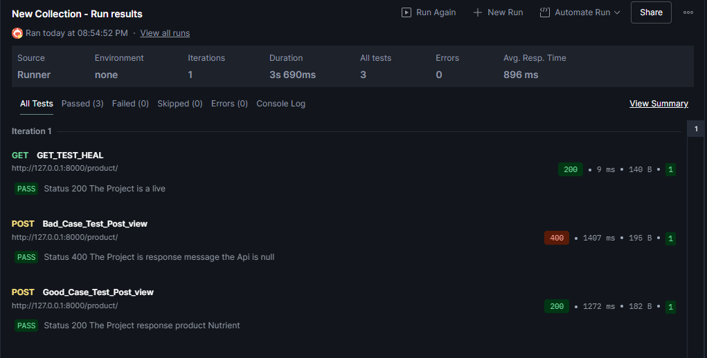
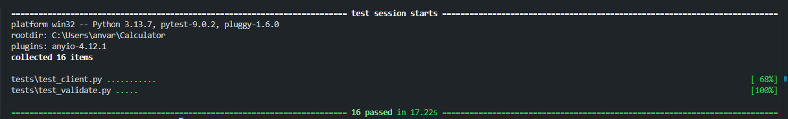

## Project Nutrient-Calculator

## Utils 🧰
Python,Pydantic,Pytest,Request

## **Description** 📚
The Project send request to Api CalorieNinjas( link: https://calorieninjas.com/api )

- In Project console get your params to request and send to Api

- Wait the Api response and validate the response if params is not good the Api send Null and the Project write "The response is null"
  else the Project send you the Nutrient of the product

- in the Project is division in Dir Validate,ApiClient,Test,Core,Backend for easy support the Project

  - Validate use Pydantic for validate you params in Console

  - ApiClient use to send Request and Validate Api Response and get Json send use Request
 
  - Test the tests the Project use Pytest for Validate and ApiClient for incorrect case and correct 

  - Core is the configur of the Project for easy change the Fields and Params have 2 fils (settings,settings_test)

  - Backend use to create endpoint and Api using FastApi

  - Test used for storage tests in the Project


## Warning ⚠️
- Create logs dir in Origin Dir for Start Project or get Error
- if you want change dir name go in Dir Core and change Costant DIR_LOGGER

## How Start the Project 🔥

In origin DIR have file view.py his is the runner for Console
```
py view.py
```

In origin DIR have Dir Backend file urls.py its used for start API
```
uvicorn Backend.urls:app
```

## How start Tests 🧪
In origin Dir have Dir tests have 3 file 
- 1 func_test utils Func for dont repeat for another 2 file in Dir Test
- 2 test_client used to test file in Dir ApiClient
- 3 test_validate used to test file in Dir Validate
Start test
```
pytest
```

## Images Tests 



