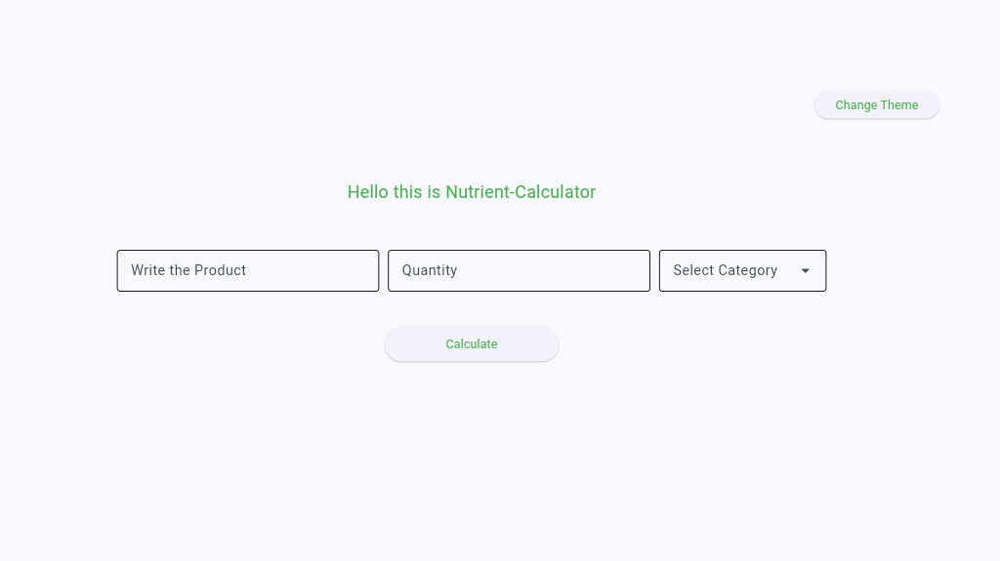
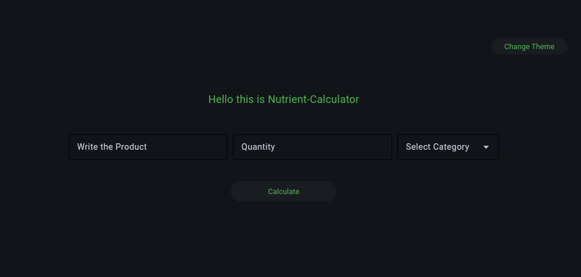
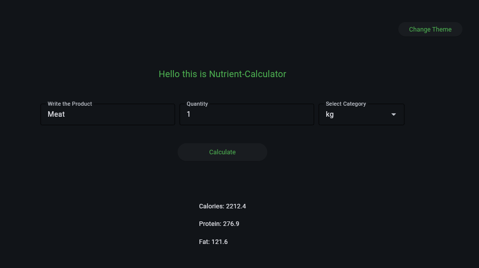

## Frontend Nutrient-calculator

### Utils 🧰 
### Library: Request
### Framework: Flet

## The Base 

The dir Frontend have Dir Controls,Core_front,Validation

- Controls this dir used to storage Control used to Flet

- Core_front this dir used to storage all Costant foreasy change params

- Validation this dir used to storage all Validation used in Frontend

#### Files:
- file manage.py used to start project and add all containers and controls

## How to start
### Use Docker Hub 
```
  docker run -p 8500:8500 -v .\Frontend\logs:/Nutrient-Calculator_Frontend/logs yourbestfriend8901/frontend_nutrient-calc:latest
```
the port 8500 if you want change 

### Use Github
Get Project
```
  git clone (my repository)
```
Dir Frontend
```
  cd Frontend
```
Start Frontend in base your OC : 

Windows
```
  py manage.py
```

Linux
```
  python manage.py
```

## Image 



